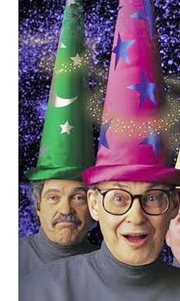
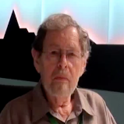
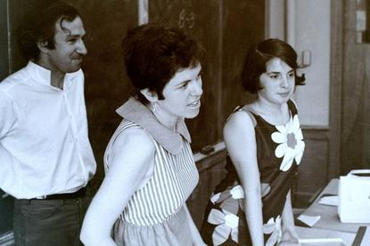
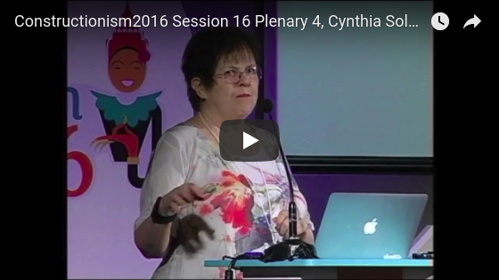
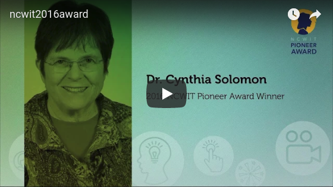
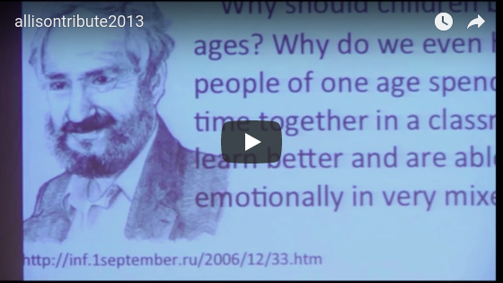
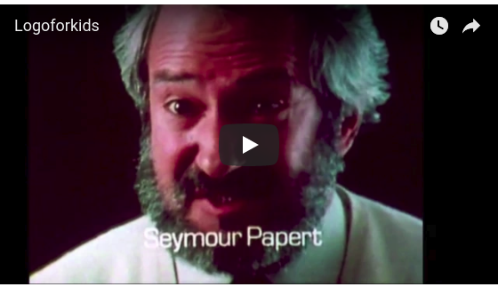
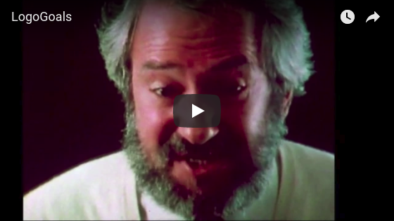

This is a collection of musing by Cynthia Solomon on the history of
the Logo programming language. This content was originally hosted on
[WikiSpaces](https://logothings.wikispaces.com/), but that site is in
the process of being shutdown. Walter Bender migrated the content to
Markdown and posted it here.

----

 Things

logothings

##  Table of Contents

1. [Home](#HOME)
2. [The 60s](The60s.md)
3. [The 70s](The70s.md)
4. [The 80s](The80s.md)
5. [Atari Research](AtariResearch.md)
6. [Seymour Speaks](SeymourSpeaks.md)
7. [Seymour Introduces Logo and Turtle Geometry](SeymourIntroduces.md)
8. [Marvin Speaks](MarvinSpeaks.md)
9. [Marvin on Education](MarvinEducation.md)
10. [Logo Projects](LogoProjects.md)
11. [Turtle Art at One Laptop per Child](TurtleOLPC.md)
12. [Books and Papers](Books.md)
13. [Contact Me](Contact.md)

# Logo is over 50 years old.

# My View of the History of Logo Especially 1967-1987

  

I started designing Logo, a language for learning, with Seymour Papert
and Wally Feurzeig in 1966 at [Bolt, Beranek and
Newman](https://en.wikipedia.org/wiki/BBN_Technologies), Cambridge,
Massachusetts. In 1967 we had a working version of Logo implemented in
Lisp running on a time-shared
[SDS 940](https://en.wikipedia.org/wiki/SDS_940).

Before I collaborated with Wally and Seymour I worked for Marvin
Minsky at the MIT AI Lab as his secretary. Seymour started his work
with Marvin before the BBN collaboration and in the summer of 1969 I
joined Papert and Marvin Minsky at the MIT AI Lab and the Logo Group
was formed. Wally at BBN continued work with Logo.

## Why this Wiki?

I started this wiki because of Seymour Papert's accident in 2006 and
because I had begun work on another wiki containing example [Logo
projects](http://logoprojects.wikispaces.com/home) including video
tutorials, images, and text. It got me thinking about the past. I
encourage contributions and have set up space in this wiki for other
people's contributions. (See
[Logo.Adventurers](http:wikispaces.com/Logo.Adventurers).)
You are welcome to add to that page or create a new one.

## Who am I?

I received a Lifetime Achievement Award at Constructionism 2016. Here
is my presentation giving a look at Logo's history.

I also received the 2016 NCWIT Pioneer Award.

In looking for early records of the past I found very few pictures and
videos, but posted what I had. (We mostly had taken screen images.)
The earliest pictures I have are from 1969\. I did find a few from the
early 1970s. Here are Marvin and Seymour in 1971.

</td>

This wiki is an experiment in collecting and presenting material on Logo.

I apologize for the redundancy.

In celebration of Logo at 50 I submitted a paper to a special issue of
the International Journal of Child-Computer Interaction. Most of the
paper was written in 1970.

[cynthia.seymour.specialissue1.docx](./documents/cynthia.seymour.specialissue1.docx)

## History

## Logo, the Language

The first running version of Logo was in 1967 and it was a place where
kids could play with words and sentences -- explore mathematics, write
stories, make games,

The Logo language went through several iterations; four or five . By
1972 the MIT Logo environment running on a [DEC
PDP-11](https://en.wikipedia.org/wiki/PDP-11) with special
turtle graphics stations which we showed at a math education
conference in Exeter, England. It was the summer of 1972 and a group
of us including Hal Abelson, Ron Lebel, Tom Knight, Margaret Minsky,
and Erric Solomon went with the equipment four weeks before the
conference. We set up Logo classes working with Exeter kids. Jeanne
Bamberger and Seymour joined us a week before the conference. (Ron
Lebel was the major hardware and software person. He chose to adapt
Tom Knight's graphics stations for the MIT AI Lab to this dedicated
Logo system. Of course, Hal Abelson was involved as were a number of
us in the language specifications. Each new implementation gave the
Logo Group a chance to review and revise the language.) I always
thought it was especially helpful that during the first few years Logo
was not widespread and thus could go through several transformations.

In the 70s there were several new implementations which took into
account new hardware capabilities. These included General Turtle's
Logo for stand alone workstations, Logo for the Apple II, TI-Logo, and
so on. Logo for the [Texas Instruments
99/4](https://en.wikipedia.org/wiki/Texas_Instruments_TI-99/4A) took
advantage of the sprite board. Now, you not only had color (introduced
by the Apple version) you had more than one turtle.

At BBN Danny Bobrow who had been a doctoral student of Marvin Minsky
and Seymour Papert was head of the Artificial Intelligence Group. He
introduced Seymour to Wally Feurzeig, who was in charge of a couple of
education projects, and Seymour began to consult on Wally's school
project. I joined Wally's group writing Lisp code to build a teaching
system for medical students.

The school project involved 5 classes, high school, junior high, and
elementary. The students were using Telcomp a language similar to
Basic except it was an interpreter. Seymour visited several classes
and was particularly struck by the absurdity of students using an
algembraic programminb language to learn algebra. He declared that
children needed a language designed for them. And so Logo was
invented.  The idea was borne in 1966 and Logo was ready for kids in
1967.

Seymour taught a summer workshop to a group of 5th graders. Wally and
I observed. I took copious notes and gave Seymour daily feedback. Logo
was totally redesigned.  In 1968-69 Seymour and I co-taught a group of
7th graders. At the end of te year Seymour declared we needed turtles!

I joined Seymour at MIT where he was a professor in the Applied Math
Department. The Logo Group as part of the MIT Artificial Intelligence
Lab was started.

## More Pages

Allison Druin's Tribute to Seymour at IDC 2013

Here Seymour talks about Logo and Basic.

Seymour articulates the goals for Logo the language.  

[Seymour gives a lesson on Logo and Turtle Geometry.](https://logothings.wikispaces.com/An%20Introduction%20to%20Logo%20and%20Turtle%20Geometry)
