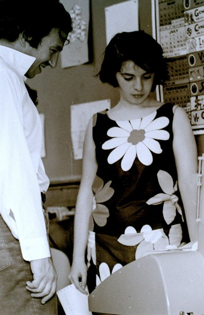
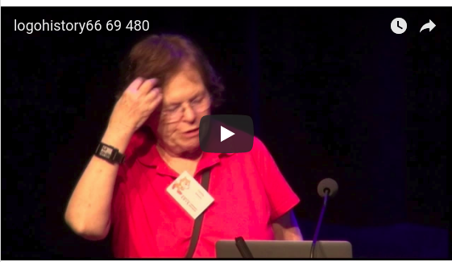
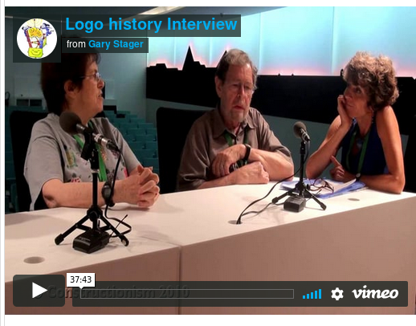
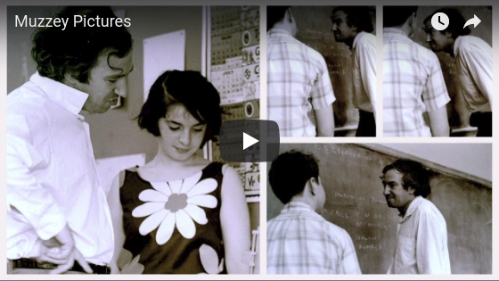

# The60s

## Logo, Papert and Constructionist Learning

## The 60s
## Starting Logo: A Language for Learning

Hi, I'm Cynthia Solomon and I collaborated with Seymour Papert and
Wally Feurzeig in developing the Logo programming language at Bolt,
Beranek and Newman (1966-69) and then in1969 I joined Seymour at the
MIT Artificial Intelligence Lab where we started the Logo Group.

Logo starts in the 1960s

In late summer of 1966 Seymour spec'd out Logo to a group of us
consisting of Wally, Dan Bobrow and Dick Grant. Seymour had been
visiting an algebra classroom where children were learning Telcomp, a
language like Basic but unlike Basic it was an interpreter (no
compiling before running the code). Seymour was struck by the
absurdity of children learning algebra by using an algebraic
programming language.

We all had a Lisp background so procedural thinking was a natural
component. In fact we initially thought of it as Baby Lisp or Lisp
without parens.  Danny started implementing Logo in Lisp on BBN's SDS
940. He gave it over to me and I gave it to Dick.

At Constructionism2012 Celia Hoyles and Gary Stager talk to Wally
Feurzeig and me about the start of Logo.

Here Seymour talks about Logo and Basic.

Seymour articulates the goals for Logo the language.

In 1967 Logo was ready to try out with children. The first group of
children to use Logo were 5th graders at the Hanscom School on the
Hanscom Air Force Base, Lincoln, Massachusetts. Seymour taught the
children; Wally and I observed. I gave Seymour constant feedback and a
new very revised version of Logo was created on a dedicated DEC PDP-1
time-sharing system.

In 1968-69 we used the PDP-1 system with 7th graders at Muzzey
Jr. High School, Lexington, MA.

## Logo Class - 7th Graders at Muzzey Jr. High 1968-1969

The class met 4 periods a week in Lexington, MA and consisted of 14
students. We had teletypes (model 33 and 35) in the classroom. They
were connected to a DEC PDP-1 computer at Bolt, Beranek and
Newman. The computer was a dedicated Logo time-shared system. Seymour
and I team taught the class. Much of what went on that year is
foundational to Seymour's book, Mindstorms. Here are pictures taken in
the Spring of 1969 by Frank Frazier.

These kids made up hilarious sentence generators and became proficient
users of their own math quizzes.

The children, Seymour and I learned a lot during the 1968-69 school
year. We accumulated programming projects. We were ready to revise the
language. Of more importance Seymour saw the need for a more concrete
(and abstract) object to play with. Turtles were born and named after
Grey-Walter's automaton tortoises Elmer and Elsie.
