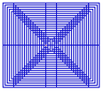
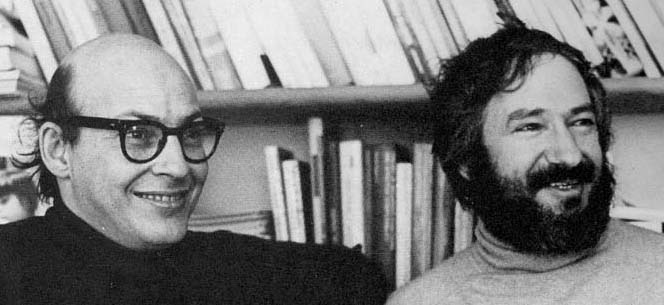
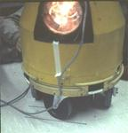
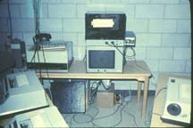
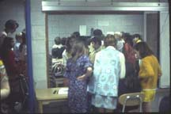
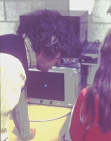
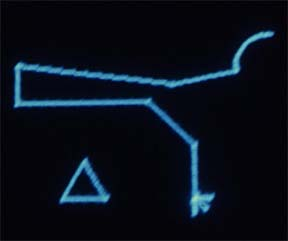
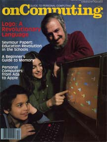

#The 80s

## My View of Logo, Papert and Constructionist Learning

Logo started at Bolt, Beranek and Newman, a research complany in
Cambridge Massachusetts. Danny Bobrow who had been a doctoral student
of Marvin Minsky and Seymour Papert was head of the Artificial
Intelligence Group. He introduced Seymour to Wally Feurzeig, woho was
in charge of a couple of education projects, and Seymour began to
consult on Wally's school project. I joined Wally's group using Lisp
to build a teaching system for medical students.

The school project involved 5 classes, high school, junior high, and
elementary. The students were using Telcomp a language similar to
Basic except it was an interpreter. Seymour visited several classes
and was particularly struck by the absurdity of students using an
algembraic programminb language to learn algebra. He declared that
children needed a language designed for them. And so Logo was
invented.  The idea was borne in 1966 and Logo was ready for kids in
1967.

Seymour taught a summer workshop to a group of 5th graders. Wally and
I observed. I took copious notes and gave Seymour daily feedback. Logo
was totally redesigned.  In 1968-69 Seymour and I co-taught a group of
7th graders. At the end of te year Seymour declared we needed turtles!

I joined Seymour at MIT where he was a professor in the Applied Math
Department. The Logo Group as part of the MIT Artificial Intelligence
Lab was started.  I have pages here: [The60s](The60s.md),
[The70s](The70s.md), [The80s](The80s.md), [Apple](Apple.md), [Logo
Atafi Cambridge Research](AtariResearch.md).

Here Seymour talks about Logo and Basic.

Seymour articulates the goals for Logo the language.  

## Papert and Talking Turtle

Talking Turtle is a 1983 video made by the Open University and the
BBC. The video captures Papert's thinking about learning and Logo and
turtles. Talking Turtle shows children actively engaged. The video was
sent to me by Russell Warfield in Australia. Here is an excerpt.

Here is the entire video broken up into five pieces.

# An Experiment in Constructionism: Dance and Computing

As Talking Turtle illustrates, Papert was interested in engaging the
whole child in the Mathland offered by Logo. Twenty years later in
2003 he continued to pursue this integration.

Seymour Papert with Jacques d'Amboise and their gangs of people set up
a stage with sensors to control sound, lights and animations at the
MIT Media Lab in the summer of 2003. Children were to learn and invent
dances that they would coordinate with music, lights, and action.

Here are some slides of the children.

You can learn more about this project
[here](http://weblogs.media.mit.edu/roballet/archives/03/07/19/index.html)
and see the children in rehearsal
[here](http://weblogs.media.mit.edu/roballet/archives/03/07/15/index.html).

## Why this Wiki?

I started this wiki because of Seymour Papert's accident and because I
had begun work on another wiki containing example [Logo
projects](LogoProjects.md) including video tutorials, images, and
text. It got me thinking about the past. I encourage contributions and
have set up space in this wiki for other people's contributions. (See
[Logo.Adventurers](LogoAdventurers.md).) You are welcome to add to
that page or create a new one.

In looking for early records of the past I found very few pictures and
videos, but posted what I had. (We mostly had taken screen images.)
Although I started Logo with Seymour Papert and Wally Feurzeig at the
research lab of Bolt, Beranek and Newman around 1966, I have
absolutely no pictures from that time. I did find a few from the early
1970s. Here are Marvin and Seymour in 1971.

I also found a video I made in 1984 when the Atari Cambridge Research
lab closed. I've split the video, which shows Logo-based research
conducted from 1982 to 1984 at Atari Cambridge Research, into seven
clips.

This wiki is an experiment in collecting and presenting material on Logo.

## Logo, the Language

The Logo language went through several iterations; four or five by
1972. The MIT version culminated in a dedicated Logo environment
running on a Digital PDP-11 with special turtle graphics stations
which we showed at a math education conference in Exeter, England. It
was the summer of 1972 and a group of us including Hal Abelson, Ron
Lebel, Tom Knight, Margaret Minsky, and Erric Solomon went with the
equipment four weeks before the conference. We set up Logo classes
working with Exeter kids. Jeanne Bamberger and Seymour joined us a
week before the conference. (Ron Lebel was the major hardware and
software person. He chose to adapt Tom Knights graphics stations for
the MIT AI Lab to this dedicated Logo system. Of course, Hal Abelson
was involved as were a number of us in the language
specifications. Each new implementation gave the Logo Group a chance
to review and revise the language.) I always thought it was especially
helpful that during the first few years Logo was not widespread and
thus could go through several transformations.

In the 70s there were several new implementations which took into
account new hardware capabilities. These included General Turtle's
Logo for stand alone workstations, Logo for the Apple II, TI-Logo, and
so on. Logo for the Texas Instruments 9900 (?) took advantage of the
special TI hardware which provided sprites. Now, you not only had
color (introduced by the Apple version) you had more than one turtle.

## The First Year-Long Class

Our first full year Logo class was in 1968-69 with seventh graders at
Muzzey Junior High School. We were at BBN at the time. In the fall of
1969 I became a member of the AI Lab and we started our Logo work
there.

The first graphics turtle and a floor turtle were built and running by
1970. The graphics turtle was not portable. Its display was driven by
a Digital PDP-6 connected to a Logo running on the lab's PDP-10. First
programs were written by Bill Gosper and other lab hackers. The yellow
turtle was assembled by Tom Callahan.

In preparation for using turtle graphics with kids Seymour began
planning a portable system. This is when Hal Abelson joined the
group. He started the design and worked with Nat Goodman on getting
the software to work.

Marvin designed and built a four voice music box for us. It was housed
in a small black translucent plastic box.

## Pictures from the Bridge School in Lexington, MA -- 1970-2

We were given 2 small rooms with a large window between them. The
graphics turtle ran on a display powered by a Data General
computer. The children used Logo over phone lines to a time-shared
Digital PDP-10 back at the MIT AI Lab.

## 5th graders with our first turtle.

## Seymour in the classroom

## Me with kids.

## Teaching Assistants
Kiyoko Okumura, Rich Fryberg and Bob Mohl

## Turtle Graphics Ramblings

## Our second turtle

## Work with Young Children
Radia Perlman's Button Box for Pre-Schoolers

## Me with First Graders in 1971-2

## 1972 Logo Re-implementation

In time for an international math education conference held at the
university in Exeter, England, Ron Lebel had led the implementation of
Logo on a dedicated time-shared DEC PDP-11. This time shared system
included "portable" turtle graphics stations based on Tom Knight's
display stations running on the AI Lab's PDP-10. Hal and Nat were
involved in the graphics. The language revisions were major and were
based on feedback from work with children. DEC helped us in shipping
equipment and setting up in Exeter four weeks before the
converence. The computer would stay at the university but the graphics
stations (5), floor turtle, and music box were returned to MIT at the
end of the conference. Several of us went over with the computer. The
group included Ron Lebel, Tom Knight, Hal Abelson, Margaret Minsky,
Erric Solomon and me. I went to work with 9, 10, 11 and 12 year old
Exeter children. Margaret, a high schooler, was my teaching assistant
and Erric, a middle schooler, joined the Exeter children. Jean
Bamberger came over later to use the music box with the
children. Seymour.also arrived a few days before the conference. We
were given a large room in close proximity to the conference rooms.
The kids became teachers to the math educators attending the
conference. The kids were incredible. Rumors spread such as Seymour
could teach anybody anything. When it was discovered that I did the
teaching, the rumors changed to we bribed the kids with candy.

## General Turtle

Something else happened that summer. Marvin, Seymour, and I along with
Russell Noftsker and Seymour's brother Alan planned to make turtles
available through a new company called General Turtle.

Later that year Marvin began designing a "portable" turtle graphics
Logo station known as the 2500.

During the decade of the 70's Logo went through several re-designs and
re-implementations and new classroom teachings. There were three major
projects that took place: the Brookline Project at the Lincoln School
where Dan Watt taught the Logo classes; the Lamplighter School in
Texas where TI Logo was tested out, and the Hennegan School project in
Boston. There was also the wonderful work of Jose Valente (also Sylvia
Weir and her team, Ann and Sue )with physically challenged and
learning disabled students at the Cotting School. Also, during the 70s
Howard Austen made a study of juggling as his doctoral work. This
circus art Seymour and I taught children as an example of
recursion. We also included bongo boarding and unicycling. (Seymour
tried balancing on a circus ball.) In the later 70s a group of MIT
students became part of the Logo Group. This included Margaret Minsky,
Danny Hillis, Gary Drescher, Jim Davis, Ed Hardebeck, Brian Silverman,
Max Behensky and more. They were housemates.

## TI Logo

One of the founders of Texas Instruments, an MIT graduate, tapped
Seymour to make a Logo for the TI "micro" computer under
development. The new machine introduced the sprite hardware allowing
for multiple turtles. Ed and Gary were deeply involved in this
implementation with help from the others.

## Celebrating TI Logo in 1981

## [Atari Cambridge Research 1982-84](AtariResearch.md)

